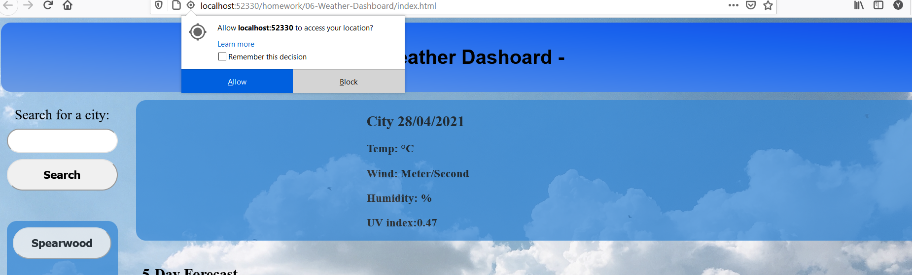
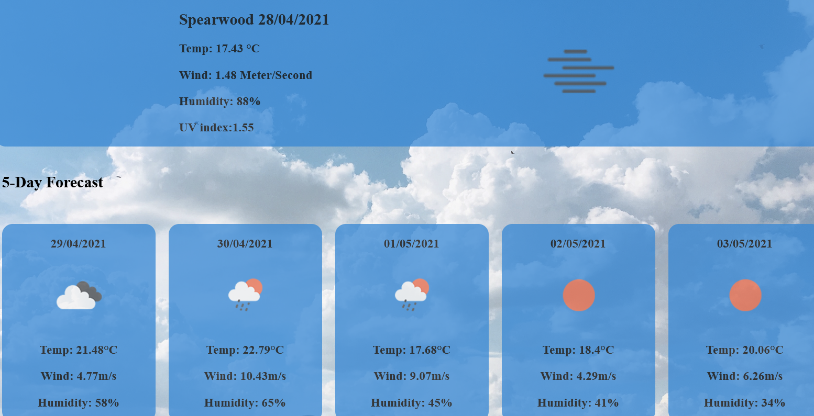
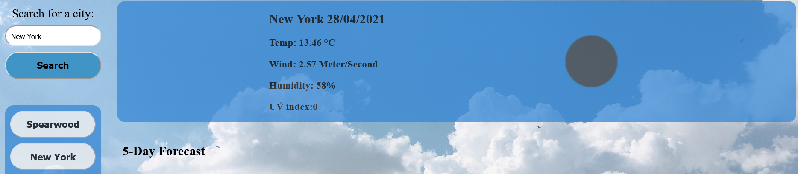

# Weather-Dashboard

A web application that gives a user a daily, and 5 day weather forecast for their current location, it also allows the user to search the forecast for differnt cities. The location data for each city is stored in a button and saved to local storage, so that a user may leave the page and upon reload they are able to locate previous searchs with a simple click. the application makes a call to the moment.js API to determine the date, it then makes a call to the navigator.geolocation API to determine the users latitude and longitude which it uses to call the open weather map API and retrieve the forecast data

* [Delployed links](#Deployed-links)

* [Technologies](#Technologies)

* [Instructions](#Instructions)

* [Author](#Author)

# Deployed-links
-GitHub
https://github.com/yurikitchin/Weather-Dashboard  
-Live Page
https://yurikitchin.github.io/Weather-Dashboard/ 

# Technologies
Project is created with: 
-HTML5 
-CSS 3 
-Javascript
-Moment.js API 
-Geolocation API 
-Open Weather Map API 

# Instructions
When the user opens the page in their browser, they are then prompted to allow their location to be accessed by the geolaction API

this latitude and longitude are the recorded and used to populate the open weather map API, which then pulls the forecast data and populates the view field

the user can then search for different cities in the search area, the simply type the name of the city into the search input and press search, this then feeds that name back into the open weather map API and repopulates the forecast areas with the new data. This also automaatically creates a new button so that the user can instantly view the weather forecast for any past searches

# Author
* Yuri Kitchin https://github.com/yurikitchin  
email - ykitchin"gmail.com

